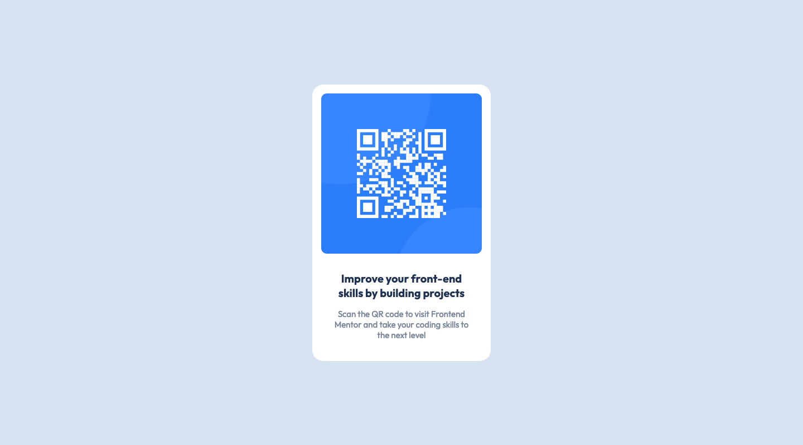

# Frontend Mentor - QR code component solution

This is a solution to the [QR code component challenge on Frontend Mentor](https://www.frontendmentor.io/challenges/qr-code-component-iux_sIO_H). Frontend Mentor challenges help you improve your coding skills by building realistic projects.

## Table of contents

- [Overview](#overview)
  - [Screenshot](#screenshot)
  - [Links](#links)
- [My process](#my-process)
  - [Built with](#built-with)
  - [What I learned](#what-i-learned)
  - [Continued development](#continued-development)
- [Author](#author)

## Overview

### Screenshot

 

### Links

- Live Site URL: [See the example from my site](https://michaelho02.github.io/Frontend_Mentor-QR_code/)

## My process

### Built with

- Semantic HTML5 markup
- CSS custom properties

### What I learned

I have learn to apply the BEM naming convention into this specific object `card` which demonnstrate through the design of my `body`.

```html
<div class="card">
  <div class="card__qr">
    
  </div>
  <div class="card__body">
    <h1 class="card__body-title">...</h1>
    <p class="card__body-paragraph">...</p>
  </div>
</div>
```

Additionally, I start to understand the fundamental of center the `card` in the middle of the screen via calculate the gap by `viewport height` and `auto` margin for the `left` and `right` using the `margin`.

```css
.card {
  background-color: var(--white);
  width: 320px;
  height: 497px;
  margin: calc((100vh - 497px) / 2) auto;
  border-radius: 20px;
  text-align: center;
}
```

### Continued development

In the near future I will try to work on ultilize the variable such as predefine the width and height of the card to optimize the repitation in `css` code.

## Author

- Website - [Ho Le Minh Thach (Michael Ho)](https://github.com/MichaelHo02)
  <!-- - Frontend Mentor - [@yourusername](https://www.frontendmentor.io/profile/yourusername) -->
  <!-- - Twitter - [@yourusername](https://www.twitter.com/yourusername) -->
